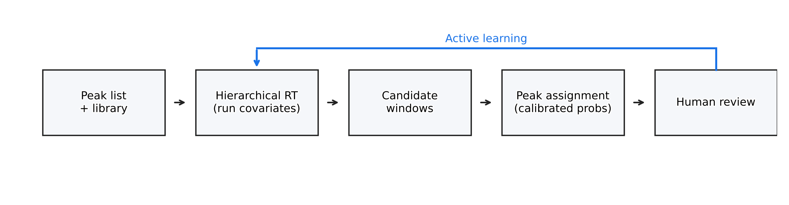
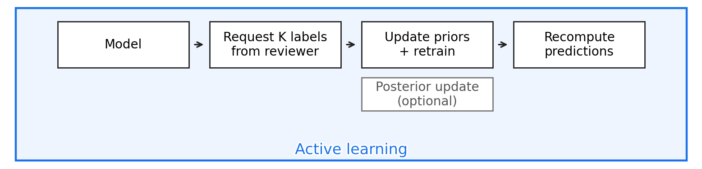

# CompAssign

## Overview

Probabilistic compound assignment for LC–MS with RT prediction and an active‑learning loop.

CompAssign predicts per‑species compound RT with pooled ridge models, filters candidates using predictive uncertainty, assigns peaks with calibrated probabilities, and
closes the loop with active learning to ask for the most valuable labels, and use that to update the model. 
Ideally, this update can be done in small retraining steps so the results are immediately available for annotators during their curation session.

See model details in [docs/bayesian_models.md](docs/bayesian_models.md).

## Project status

- [x] RT prediction with run level covariates (in progress)
- [ ] Peak assignment improvements and calibration (skeleton in repo)
- [ ] Active learning loop refinements and UX (skeleton in repo)
- [ ] Evaluation and reporting polish

We are currently refining the RT prediction stage. The assignment and AL stages exist as working skeletons and will improve next.

### System overview

- RT prediction shares information across species and classes, improving coverage and narrowing windows when evidence is strong.
- Assignment returns calibrated probabilities with an explicit null, enabling auditable operating points.
- Active learning converts reviewer effort into measurable gains with clear stopping rules.




## Quick start

```bash
poetry install
poetry shell  # or prefix commands with `poetry run`
```

This repository provides a small set of shell scripts that orchestrate the main stages.

- `scripts/run_rt_prod.sh` trains the production RT ridge models (partial pooling + fallbacks) from `repo_export/` RT CSVs; use `--quick` for a smoke run.
- `scripts/run_rt_prod_eval.sh` evaluates the trained coefficient summaries on `realtest` and regenerates the comparison plots.
- `scripts/plot_rt_multilevel.sh` regenerates the evaluation plots for a run directory produced by `scripts/run_rt_prod.sh`.
- `scripts/pipelines/run_validation.sh` executes a small validation suite and produces a brief summary; use it for local smoke checks.

Legacy synthetic/active-learning runners (`scripts/pipelines/run_training.sh`, `scripts/pipelines/run_al.sh`) are currently
disabled pending a port to the current RT ridge pipeline.

## License

Proprietary to Metabolon. All rights reserved.
